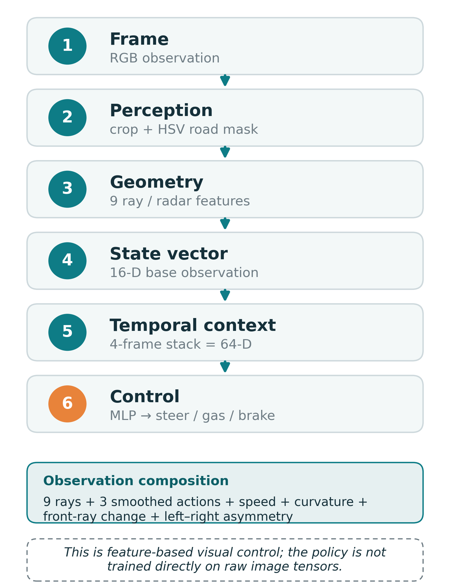

# Image Processing Project

**Feature-Based Image Processing and Reinforcement Learning for CarRacing-v3**

_Joe / Student ID 1103820_

An inspectable image-processing pipeline converts CarRacing-v3 RGB frames into
compact road-geometry features for PPO/SAC control evaluation.

## Demo

<p align="center">
  <a href="https://ultralamb.github.io/Image-Processing-Project/">
    
  </a>
</p>

<p align="center">
  <strong>PPO completed baseline</strong> - open the live demo page for a pauseable video player.<br>
  <a href="https://ultralamb.github.io/Image-Processing-Project/"><strong>Open live demo page</strong></a>
  &middot;
  <a href="final/videos/README.md">Full 12-clip gallery</a>
</p>

GitHub README pages do not reliably render repo-local HTML video tags, so the
live demo page provides the pauseable video player.

## Key Results

| Branch | Status | Validated eval | Best parsed eval |
| ------ | ------ | -------------- | ---------------- |
| PPO completed baseline | Completed 500K baseline | 938.87 +/- 7.86 @ 500,000 | 939.53 +/- 4.09 @ 480,000 |
| SAC fast-result branch | Partial 400K best-checkpoint / fast-result branch | 938.51 +/- 4.88 @ 400,000 | 938.51 +/- 4.88 @ 400,000 |

**Conservative interpretation.** PPO is a fully completed 500K baseline. SAC is
a strong but partial fast-result branch whose validated number is the 400K
checkpoint. The PPO/SAC comparison is not compute-equivalent, and SAC is not
claimed to beat PPO. CarRacing-v3 is not claimed to be solved.

## Method at a glance

<p align="center">
  
</p>

- RGB frame from Gymnasium CarRacing-v3.
- HSV road mask and compact road-geometry extraction.
- Ray/radar features summarized into a 16D base observation.
- Four-frame temporal stack produces a 64D policy input.
- Standard Stable-Baselines3 PPO/SAC MLP policies evaluate the representation.

This project package does not include raw-pixel CNN policy training.

## Project Materials

| Material | Link |
| -------- | ---- |
| Final IEEE-style report (PDF) | [`Image_Processing_Project_V2_IEEE_Report.pdf`](final/report/Image_Processing_Project_V2_IEEE_Report.pdf) |
| Overleaf / LaTeX package | [`final/overleaf/Image_Processing_Project_Overleaf_Package.zip`](final/overleaf/Image_Processing_Project_Overleaf_Package.zip) |
| Final presentation (PDF) | [`final/slides/Image_Processing_Project_Final_Presentation.pdf`](final/slides/Image_Processing_Project_Final_Presentation.pdf) |
| Final presentation (PPTX) | [`final/slides/Image_Processing_Project_Final_Presentation.pptx`](final/slides/Image_Processing_Project_Final_Presentation.pptx) |
| PPO notebook | [`final/notebooks/Final_PPO_Baseline_CarRacing_v3.ipynb`](final/notebooks/Final_PPO_Baseline_CarRacing_v3.ipynb) |
| SAC notebook | [`final/notebooks/Final_SAC_Fast_Result_CarRacing_v3.ipynb`](final/notebooks/Final_SAC_Fast_Result_CarRacing_v3.ipynb) |
| Result summary | [`final/docs/RESULT_SUMMARY.md`](final/docs/RESULT_SUMMARY.md) |
| Figures | [`final/figures/`](final/figures/) |
| Video gallery | [`final/videos/README.md`](final/videos/README.md) |

## Repository Structure

```text
final/                 public-facing final package
  report/              final IEEE-style report (PDF / DOCX)
  overleaf/            LaTeX source package for the report
  slides/              final presentation (PPTX / PDF)
  notebooks/           PPO and SAC notebooks with saved outputs
  figures/             report and slide figures + demo poster
  tables/              CSV result evidence
  videos/              demo MP4s, previews, manifest, gallery README
  logs/                training and evaluation logs
  docs/                result summary, run instructions, dataset notes
  validation/          static validation report
archive/               preserved history, not the current project package
```

## How to review / reproduce

Start with [`final/README.md`](final/README.md), the
[result summary](final/docs/RESULT_SUMMARY.md), and the final report. The
notebooks are kept in safe report/evaluation mode and include saved output
evidence; they do not require retraining to inspect. Do not rerun training
unless you intentionally change the project scope.

Key evidence paths:

- [Logs](final/logs/) - headline metrics are parsed from these.
- [Tables](final/tables/) - checkpoint and summary CSV evidence.
- [Validation report](final/validation/validation_report.md) - static package checks.
- [Run instructions](final/docs/RUN_INSTRUCTIONS.md) - reading/inspection guidance.

## Limitations

- The SAC fast-result branch is a partial 400K checkpoint, not a completed 500K run.
- SAC is not claimed to beat PPO.
- PPO and SAC are not a compute-equivalent comparison.
- This project package does not include raw-pixel CNN policy training.
- The project does not make a solved-status claim for CarRacing-v3.
- HSV-style visual preprocessing can be sensitive to rendering and track appearance changes.

## Archived Research History

The original V1 PPO-only submission and the dated V2 build snapshot are preserved
under [`archive/`](archive/) for traceability. They are not the current public
project package. V1 results must not be confused with the V2 PPO/SAC results
above.

## References / Related Tools

- [Gymnasium CarRacing-v3](https://gymnasium.farama.org/environments/box2d/car_racing/)
- [Stable-Baselines3](https://stable-baselines3.readthedocs.io/)
- [Stable-Baselines3 PPO](https://stable-baselines3.readthedocs.io/en/master/modules/ppo.html)
- [Stable-Baselines3 SAC](https://stable-baselines3.readthedocs.io/en/master/modules/sac.html)
- [PPO paper (arXiv:1707.06347)](https://arxiv.org/abs/1707.06347)
- [SAC paper (arXiv:1801.01290)](https://arxiv.org/abs/1801.01290)
- [OpenCV color spaces](https://docs.opencv.org/4.x/df/d9d/tutorial_py_colorspaces.html)
