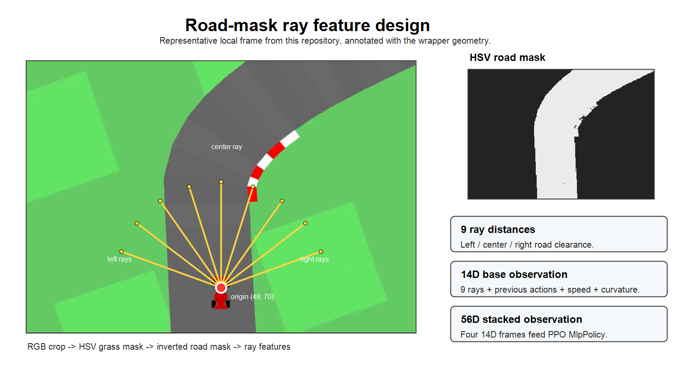

# CarRacing-v3 Feature-Based Reinforcement Learning

This repository contains feature-based reinforcement learning experiments for
Gymnasium `CarRacing-v3`, including the original PPO-only course submission and
a later PPO/SAC feature-release update.

## Versions

| Version | Location | Summary |
| ------- | -------- | ------- |
| V1 original course submission | repository root | PPO-only ray-feature project with 14D observations stacked to 56D |
| V2 PPO/SAC feature release | [`versions/2026-06-24-ppo-sac-feature-release/`](versions/2026-06-24-ppo-sac-feature-release/) | Later feature-based PPO/SAC update |

The sections below describe the original V1 root package; see the V2 folder for
the later PPO/SAC update.

## Quick Links

### V1 Original Package

- [V1 notebook](notebooks/CarRacingV3_PPO_Final_Submission.ipynb)
- [V1 report PDF](report/CarRacingV3_PPO_Final_Report.pdf)
- [V1 artifact zip](artifacts/CarRacingV3_PPO_Final_Submission.zip)
- [V1 presentation](slides/CarRacingV3_PPO_Final_Presentation_REBUILT.pptx)

### V2 PPO/SAC Update

- [V2 folder](versions/2026-06-24-ppo-sac-feature-release/)
- [V2 report DOCX](versions/2026-06-24-ppo-sac-feature-release/report/CarRacing_v3_RL_Report_1103820_REVISED.docx)
- [V2 PPO notebook](versions/2026-06-24-ppo-sac-feature-release/notebooks/Final_PPO_Baseline_CarRacing_v3.ipynb)
- [V2 SAC notebook](versions/2026-06-24-ppo-sac-feature-release/notebooks/Final_SAC_Fast_Result_CarRacing_v3.ipynb)
- [V2 result summary](versions/2026-06-24-ppo-sac-feature-release/docs/RESULT_SUMMARY.md)
- [V2 media/videos](versions/2026-06-24-ppo-sac-feature-release/media/videos/)
- [V2 media manifest](versions/2026-06-24-ppo-sac-feature-release/media/video_manifest.csv)
- [V2 media notes](versions/2026-06-24-ppo-sac-feature-release/MEDIA.md)
- [V2 release notes](versions/2026-06-24-ppo-sac-feature-release/RELEASE_NOTES_V2.md)

## Quick Result Snapshot

| Package      | Main result                                                                                          | Conservative interpretation                                            |
| ------------ | ---------------------------------------------------------------------------------------------------- | ---------------------------------------------------------------------- |
| V1 PPO-only  | best raw reward 929.7; RANDOM10 mean raw reward 614.1                                                | promising sample efficiency, but not uniformly robust                  |
| V2 PPO V9    | final eval 938.87 +/- 7.86 @ 500,000; best parsed eval 939.53 +/- 4.09 @ 480,000                     | completed 500K feature-based PPO baseline                              |
| V2 SAC V11.1 | validated checkpoint 938.51 +/- 4.88 @ 400,000                                                       | partial 400K best-checkpoint fast-result branch only |

## V1 Original PPO-only Submission

### Overview

This repository contains a reproducible CarRacing-v3 PPO project built around
deterministic road-mask ray features. Instead of training PPO directly on 96x96
RGB pixels, the environment wrapper converts each frame into a compact
road-geometry vector, allowing Stable-Baselines3 PPO with `MlpPolicy` to train
on a 56D stacked observation.

The final artifact demonstrates promising sample efficiency under a
500,000-timestep budget, reaching a best raw reward of 929.7. However, the
RANDOM10 mean raw reward is 614.1 with high variance, and low-reward failure
seeds remain. The project should therefore be interpreted as a compact
representation study, not as a fully robust CarRacing solution.

### Method Summary

The PPO algorithm is unchanged. The main contribution is the deterministic
observation wrapper and the reproducible evaluation package around it.

```text
RGB frame -> crop -> HSV grass mask -> inverted road mask -> 9 rays -> 14D vector -> 4-frame stack -> 56D PPO input
```

The base observation contains 9 road-distance rays, previous
steering/gas/brake actions, speed, and a curvature proxy. Four consecutive 14D
observations are stacked into the 56D vector used by PPO. The final policy uses
Stable-Baselines3 PPO with `MlpPolicy`, plus smoothed steering/gas/brake actions
during environment interaction.

### Ray Feature Visualization



The figure shows a representative local CarRacing frame from this repository,
the HSV road-mask interpretation, 9 ray distances from origin `(48, 70)`, and
the 14D-to-56D observation design.

### Repository Contents

- [`report/`](report/) - IEEE-style report PDF and LaTeX source.
- [`slides/`](slides/) - rebuilt final presentation.
- [`notebooks/`](notebooks/) - clean final notebook.
- [`figures/`](figures/) - method and result figures.
- [`tables/`](tables/) - CSV result tables.
- [`artifacts/`](artifacts/) - saved model, evaluation data, and video artifact
  package.
- [`DATASET.md`](DATASET.md) - dataset and environment explanation.
- [`requirements.txt`](requirements.txt) - Python dependencies.

Key files:

- [Clean final notebook](notebooks/CarRacingV3_PPO_Final_Submission.ipynb)
- [Artifact package](artifacts/CarRacingV3_PPO_Final_Submission.zip)
- [COMPARE5 results](tables/compare5_results.csv)
- [RANDOM10 results](tables/random10_results.csv)
- [Training curve](figures/training_curve_clean.png)
- [Final multi-seed rewards](figures/final_multiseed_rewards_clean.png)

### Quick Start

1. Clone the repository.
2. Install dependencies from [`requirements.txt`](requirements.txt).
3. Open
   [`notebooks/CarRacingV3_PPO_Final_Submission.ipynb`](notebooks/CarRacingV3_PPO_Final_Submission.ipynb)
   in Colab or local Jupyter.
4. Use
   [`artifacts/CarRacingV3_PPO_Final_Submission.zip`](artifacts/CarRacingV3_PPO_Final_Submission.zip)
   or rerun selected evaluation cells.
5. Reload the PPO model and VecNormalize statistics together.

Exact reproduction is not promised on every machine. Package versions,
rendering backend, and environment differences can affect masks, normalization,
and rewards. The saved artifacts and CSV-backed evaluation tables are the
evidence for the submitted run.

### Results

| Split    | Mean  | Std.  | Min   | Max   |
| -------- | ----: | ----: | ----: | ----: |
| COMPARE5 | 609.1 | 348.2 | 210.8 | 896.0 |
| RANDOM10 | 614.1 | 347.8 | 55.5  | 929.7 |

Best raw reward: 929.7.

Some seeds reach near-900 reward, showing that the compact road-feature
representation can produce strong driving episodes. Failure seeds remain near
55-56 reward, showing incomplete robustness. The best score shows capability;
the low-reward seeds show that the policy is not uniformly reliable.

### Public Context / Not a Matched Baseline

RL Baselines3 Zoo provides a public CarRacing-v3 PPO configuration using image
preprocessing, reward normalization, 8 environments, 4e6 timesteps, and
`CnnPolicy`. Separately, the Hugging Face `frankcholula/ppo_lstm-CarRacing-v3`
model card describes a public RecurrentPPO / `CnnLstmPolicy` model also trained
with 4e6 timesteps. These sources are used only as public configuration
context. They were not rerun in this project and are not treated as matched
baselines.

This project does not claim to beat RL Zoo. It does not claim to beat the
Hugging Face `ppo_lstm` model. It does not claim a solved CarRacing-v3
environment. The measured evidence in this repository belongs only to this
submitted ray-feature PPO artifact.

References:

- [RL Zoo `ppo.yml`](https://github.com/DLR-RM/rl-baselines3-zoo/blob/master/hyperparams/ppo.yml)
- [Hugging Face `ppo_lstm-CarRacing-v3`](https://huggingface.co/frankcholula/ppo_lstm-CarRacing-v3)
- [Gymnasium CarRacing-v3](https://gymnasium.farama.org/environments/box2d/car_racing/)
- [PPO paper](https://arxiv.org/abs/1707.06347)
- [Stable-Baselines3 PPO](https://stable-baselines3.readthedocs.io/en/master/modules/ppo.html)
- [OpenCV colorspaces](https://docs.opencv.org/4.x/df/d9d/tutorial_py_colorspaces.html)

### Limitations

- No matched CNN/RL Zoo baseline was rerun.
- HSV thresholding depends on visual rendering.
- Local rays are weak after off-road drift.
- Action smoothing can delay recovery.
- Evaluation reward has high variance across seeds.
- For the original V1 course submission, PPO-vs-SAC comparison was not part of
  the submitted package; the later V2 folder contains a separate PPO/SAC
  feature-based update.

### Report and Slides

- [Final report PDF](report/CarRacingV3_PPO_Final_Report.pdf)
- [Final presentation](slides/CarRacingV3_PPO_Final_Presentation_REBUILT.pptx)
