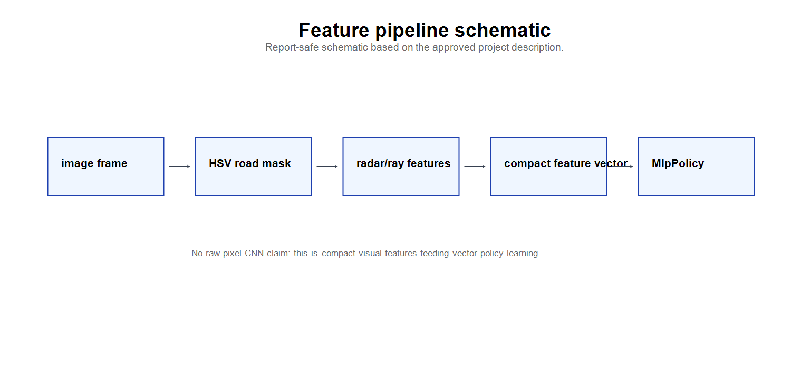
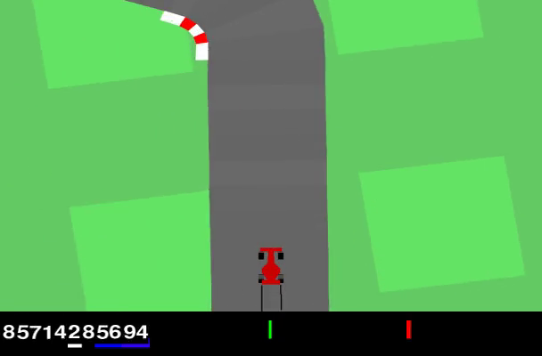

# Image Processing Project

**Feature-Based Image Processing and Reinforcement Learning for CarRacing-v3**

_Joe · Student ID 1103820_

This project turns rendered RGB driving frames into a compact, inspectable
visual feature representation, then uses off-the-shelf PPO and SAC policies as
downstream evaluators on Gymnasium `CarRacing-v3`. The contribution is the
image-processing pipeline; the reinforcement-learning algorithms are evaluation
tools, not the novelty.

<p align="center">
   HSV road mask -> ray/radar features -> compact observation -> PPO/SAC policy" width="720">
</p>

## Demo preview

<p align="center">
  <a href="final/videos/best_ppo_demo.mp4">
    
  </a>
  <br>
  <em>Best PPO baseline clip (raw reward 936). The full 12-clip gallery is in
  <a href="final/videos/README.md">final/videos/README.md</a>.</em>
</p>

---

## Final submission materials

| Material | Link |
| -------- | ---- |
| Final IEEE-style report (PDF) | [`Image_Processing_Project_V2_IEEE_Report.pdf`](final/report/Image_Processing_Project_V2_IEEE_Report.pdf) |
| Overleaf / LaTeX package | [`final/overleaf/Image_Processing_Project_Overleaf_Package.zip`](final/overleaf/Image_Processing_Project_Overleaf_Package.zip) |
| Final presentation (PDF) | [`final/slides/Image_Processing_Project_Final_Presentation.pdf`](final/slides/Image_Processing_Project_Final_Presentation.pdf) |
| Final presentation (PPTX) | [`final/slides/Image_Processing_Project_Final_Presentation.pptx`](final/slides/Image_Processing_Project_Final_Presentation.pptx) |
| PPO notebook | [`final/notebooks/Final_PPO_Baseline_CarRacing_v3.ipynb`](final/notebooks/Final_PPO_Baseline_CarRacing_v3.ipynb) |
| SAC notebook | [`final/notebooks/Final_SAC_Fast_Result_CarRacing_v3.ipynb`](final/notebooks/Final_SAC_Fast_Result_CarRacing_v3.ipynb) |
| Result summary | [`final/docs/RESULT_SUMMARY.md`](final/docs/RESULT_SUMMARY.md) |
| Figures | [`final/figures/`](final/figures/) |
| Video gallery | [`final/videos/README.md`](final/videos/README.md) |

## Key results

| Branch | Status | Validated eval | Best parsed eval |
| ------ | ------ | -------------- | ---------------- |
| PPO completed baseline | Completed 500K baseline | 938.87 +/- 7.86 @ 500,000 | 939.53 +/- 4.09 @ 480,000 |
| SAC fast-result branch | Partial 400K best-checkpoint / fast-result branch | 938.51 +/- 4.88 @ 400,000 | 938.51 +/- 4.88 @ 400,000 |

**Conservative interpretation.** PPO is a fully completed 500K baseline. SAC is
a strong but **partial** fast-result branch whose validated number is the 400K
checkpoint. The PPO/SAC comparison is **not** compute-equivalent, and SAC is not
claimed to beat PPO. CarRacing-v3 is not claimed to be solved.

A key design point: PPO and SAC share the **same 16-dimensional base / 64-dimensional
temporally stacked visual feature pipeline**. The perception layer is held
constant; only the downstream policy optimization method changes.

## Image processing pipeline

```text
RGB frame -> crop/preprocess -> HSV road mask -> ray/radar features -> stacked observation -> PPO/SAC policy
```

Each 96x96 RGB frame is cropped, converted to HSV, thresholded into a road mask
(grass removed by HSV range), cleaned with morphological opening, and summarized
by nine distance rays cast across a calibrated angular fan. The compact
observation vector is temporally stacked and passed to a standard
Stable-Baselines3 MLP policy. No raw image-input CNN policy was trained.

## Repository structure

```text
final/                 public-facing final package
  report/              final IEEE-style report (PDF / DOCX)
  overleaf/            LaTeX source package for the report
  slides/              final presentation (PPTX / PDF)
  notebooks/           PPO and SAC notebooks with saved outputs
  figures/             report and slide figures + demo poster
  tables/              CSV result evidence
  videos/              12 demo MP4s + video_manifest.csv + gallery README
  logs/                training and evaluation logs
  docs/                result summary, run instructions, dataset notes
  validation/          static validation report
archive/               preserved history (not the final submission)
  v1_original_submission/   original V1 PPO-only submission
  legacy_versions/          dated V2 build snapshot (promoted to final/)
  internal_traceability/    internal->neutral filename/label map
```

## How to review / reproduce

Start with [`final/README.md`](final/README.md), the
[result summary](final/docs/RESULT_SUMMARY.md), and the final report. The
notebooks are kept in safe report/evaluation mode and include saved output
evidence — they do not require retraining to inspect. Do not rerun training
unless you intentionally change the project scope.

Key evidence paths:

- [Logs](final/logs/) — headline metrics are parsed from these.
- [Tables](final/tables/) — checkpoint and summary CSV evidence.
- [Validation report](final/validation/validation_report.md) — static package checks.
- [Run instructions](final/docs/RUN_INSTRUCTIONS.md) — reading/inspection guidance.

## Limitations

- The SAC fast-result branch is a partial 400K checkpoint, not a completed 500K run.
- SAC is not claimed to beat PPO.
- PPO and SAC are not a compute-equivalent comparison.
- No raw image-input CNN policy was trained in this submission.
- CarRacing-v3 is not claimed to be solved.
- HSV-style visual preprocessing can be sensitive to rendering and track appearance changes.

## Archived research history

The original V1 PPO-only submission and the dated V2 build snapshot are preserved
under [`archive/`](archive/) for traceability. They are **not** the final-facing
submission for this course. V1 results must not be confused with the V2 PPO/SAC
results above.

## References / related tools

- [Gymnasium CarRacing-v3](https://gymnasium.farama.org/environments/box2d/car_racing/)
- [Stable-Baselines3](https://stable-baselines3.readthedocs.io/)
- [Stable-Baselines3 PPO](https://stable-baselines3.readthedocs.io/en/master/modules/ppo.html)
- [Stable-Baselines3 SAC](https://stable-baselines3.readthedocs.io/en/master/modules/sac.html)
- [PPO paper (arXiv:1707.06347)](https://arxiv.org/abs/1707.06347)
- [SAC paper (arXiv:1801.01290)](https://arxiv.org/abs/1801.01290)
- [OpenCV color spaces](https://docs.opencv.org/4.x/df/d9d/tutorial_py_colorspaces.html)
